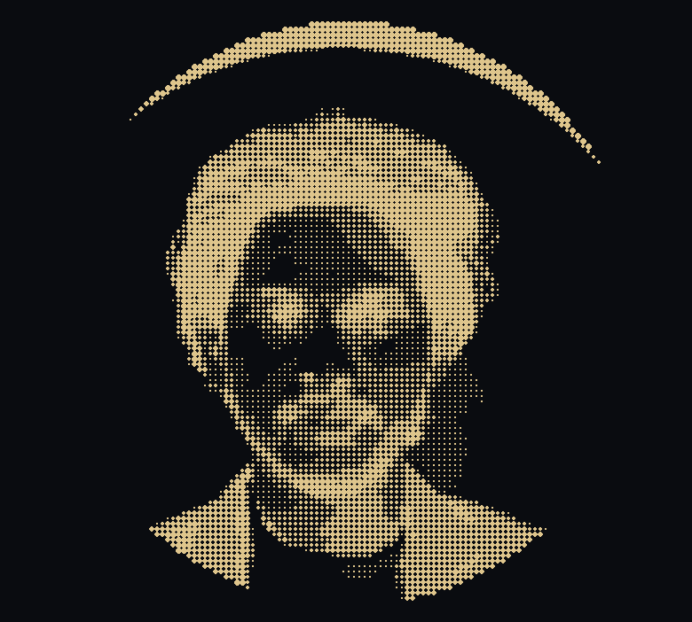

<!--
============================================================
  HOW TO USE THIS FILE
============================================================
1. Create a repo named EXACTLY your GitHub username
   (e.g. github.com/Vijay0567/Vijay0567) and make it Public.
2. Put this file inside it as README.md
3. Put BOTH attached images inside an "assets" folder in
   that same repo, keeping these exact names:
   -> assets/ascii_photo.png
   -> assets/profile_photo.png
4. Replace every "Vijay0567" below with your real
   GitHub username, in lowercase, no spaces (Ctrl+F / Find
   & Replace). Do this for ALL occurrences, including the
   ones inside the stat-image links further down.
5. Commit, then open your GitHub profile page and hard
   refresh (Ctrl+Shift+R) — the stat images cache for a
   few minutes.
============================================================
-->

<div align="center">


</div>

<table width="100%">
<tr>
<td width="30%" valign="top">


### Vijay Gampala
**Data Scientist • ML Engineer**
Python Developer • Software Engineer

Computer Science undergraduate passionate about building intelligent systems, analyzing data and creating impactful solutions.

📍 Andhra Pradesh, India
🔗 [vijay-gampala.vercel.app](https://vijay-gampala.vercel.app)
📅 Joined Dec 2023

[](https://github.com/Vijay0567)
[](https://linkedin.com/in/vijay-gampala)
[](mailto:vijaygampala0567@gmail.com)
[](https://vijay-gampala.vercel.app)

---

**GitHub Overview**

| | |
|---|---|
| 💻 Repositories | 42 |
| ⭐ Stars | 83 |
| 👥 Followers | 112 |
| 👣 Following | 96 |
| ⚡ Contributions | 314+ |

</td>
<td width="70%" valign="top">

```
vijay@github:~$ neofetch
```

<table width="100%">
<tr>
<td width="30%" valign="top">



</td>
<td valign="top">

| | |
|:---|:---|
| **OS** | Windows 11 64-bit |
| **Host** | HP Laptop 15s |
| **Kernel** | Python 3.13.0 |
| **Shell** | PowerShell 7 |
| **Editor** | Visual Studio Code |
| | |
| **Languages** | Python, SQL, Java, C, C++ |
| **Frameworks** | Django, Streamlit |
| **Libraries** | Pandas, NumPy, Scikit-learn, Matplotlib, Seaborn |
| | |
| **Database** | MySQL |
| **Tools** | Git, GitHub, Power BI, Excel, VS Code, Jupyter |
| | |
| **Education** | B.Tech CSE @ LPU |
| **Location** | Andhra Pradesh, India |
| | |
| **Portfolio** | vijay-gampala.vercel.app |
| **LinkedIn** | linkedin.com/in/vijay-gampala |
| **Email** | vijaygampala0567@gmail.com |

</td>
</tr>
</table>

```
vijay@github:~$ 
```

</td>
</tr>
</table>

<br>

<div align="center">

<!-- STAT CARDS -->


</div>

<br>

<table width="100%">
<tr>
<td width="33%">

**🔥 GitHub Streak**


</td>
<td width="34%">

**📈 Contribution Graph**


</td>
<td width="33%">

**💻 Top Languages**


</td>
</tr>
</table>

<br>

### 🚀 Pinned Repositories

<div align="center">


</div>

<br>

<div align="center">

_"The best way to predict the future is to create it."_ — Peter Drucker

</div>
